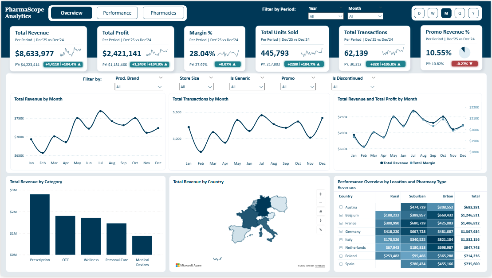
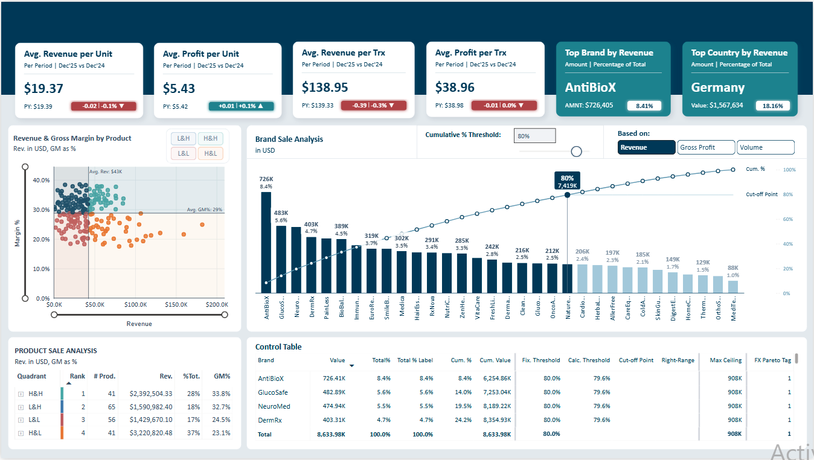
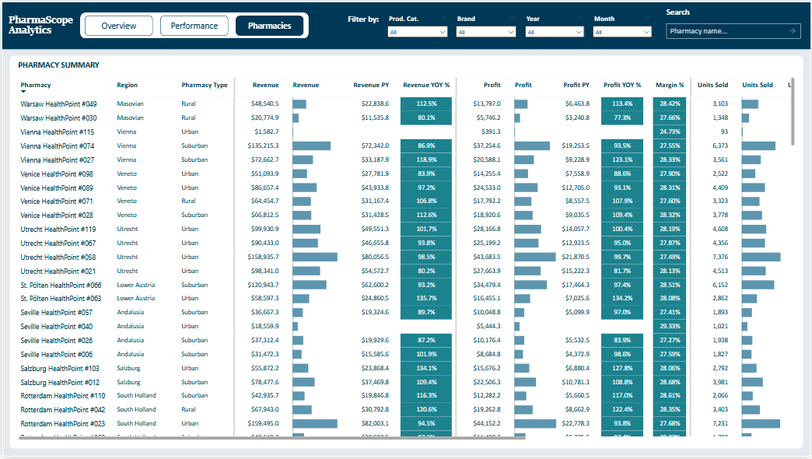

# PharmaScope Analytics

### A Comprehensive Multi-Country Pharmacy Performance Analysis

⸻

## 📌 Project Overview

This project analyzes the financial and operational performance of a multi-country pharmacy network using Power BI.

The goal of this analysis was not only to build a dashboard, but to extract meaningful business insights that can guide strategic decisions.

The analysis covers:

- Revenue and Profit performance  
- Year-over-Year growth  
- Margin behavior  
- Geographic distribution  
- Store size and pharmacy type comparison  
- Brand concentration using Pareto analysis  
- Promotion impact  
- Operational efficiency metrics  

⸻

## 📊 Business Questions Addressed

1. Is revenue growth sustainable and profitable?  
2. What is driving revenue growth — price or volume?  
3. Which countries and store types contribute most to revenue?  
4. Is the company over-dependent on a few brands?  
5. How efficient are transactions and unit sales?  
6. Does promotion significantly drive performance?  

⸻

## 🗂 Dataset Description

The dataset includes:

- Transaction-level sales data  
- Revenue and profit values  
- Product category and brand  
- Promotion flag  
- Store size band  
- Pharmacy type  
- Country and region  
- Date hierarchy including year, quarter, and month  

Time comparison was conducted between **2024 and 2025**.

⸻

## 📈 Key Findings

### 1️⃣ Strong Revenue Growth

Revenue increased from **$4.22M in 2024** to **$8.63M in 2025**.  
Profit also doubled to **$2.42M**.  
Margin improved slightly to **28%**.

This indicates **profitable scaling**.

⸻

### 2️⃣ Growth Is Volume Driven

Units sold and transactions more than doubled.  
Average revenue per transaction slightly declined.

This suggests growth is driven by **higher volume rather than price increases**.

⸻

### 3️⃣ Geographic Concentration Risk

Germany contributes the highest revenue share.  
Urban pharmacies significantly outperform rural stores.

High geographic concentration increases exposure risk.

⸻

### 4️⃣ Brand Revenue Concentration

Pareto analysis shows approximately **80% of revenue comes from a limited number of brands**.

Heavy dependence on top brands creates supply and regulatory risk.

⸻

### 5️⃣ Promotion Strategy

Promo revenue percentage slightly declined despite revenue doubling.

This suggests growth was **not promotion-dependent**, though targeted optimization could further improve margins.

⸻

## 📊 Dashboard Pages

### 🔹 Overview Page

**High-level performance snapshot across revenue, profitability, and operational metrics**

This page highlights KPIs including:
- Revenue  
- Profit  
- Margin  
- Units Sold  
- Transactions  
- Promo Revenue Percentage  

⸻

### 🔹 Performance Page

**Deep dive into product, brand, and margin behavior**

This page analyzes:
- Revenue vs Margin distribution  
- Brand Pareto (80/20) analysis  
- Product performance quadrants  

⸻

### 🔹 Pharmacies Page

**Store-level performance comparison across regions and formats**

This page provides store-level insights including:
- Revenue YoY  
- Profit YoY  
- Margin  
- Units Sold  

⸻

## 🌍 Interactive Dashboard

👉 [Click here to explore the interactive Power BI dashboard](https://app.powerbi.com/view?r=eyJrIjoiNjBiNThkODAtZmNlNC00YjA2LTgzZDQtOWNjNThjNWJlZGU4IiwidCI6IjA3NTY1ZTVjLTU2ODEtNDk5OC1hN2RjLTU1OGZiM2U2OGU3NSJ9)

⸻

## 🧠 Strategic Recommendations

1. Diversify geographic revenue base  
2. Optimize product portfolio to reduce brand concentration risk  
3. Improve rural pharmacy performance strategy  
4. Increase average basket value through cross-selling  
5. Refine targeted promotion campaigns  
6. Replicate Q3 peak strategies across other quarters  

⸻

## 🛠 Tools Used

- Power BI  
- DAX  
- Data Modeling  
- Pareto Analysis  
- Geospatial Analysis  

⸻

## 📌 Conclusion

This project demonstrates how data visualization combined with business thinking can uncover strategic insights beyond surface-level metrics.

Revenue growth alone does not define success.

**Understanding what drives it does.**
